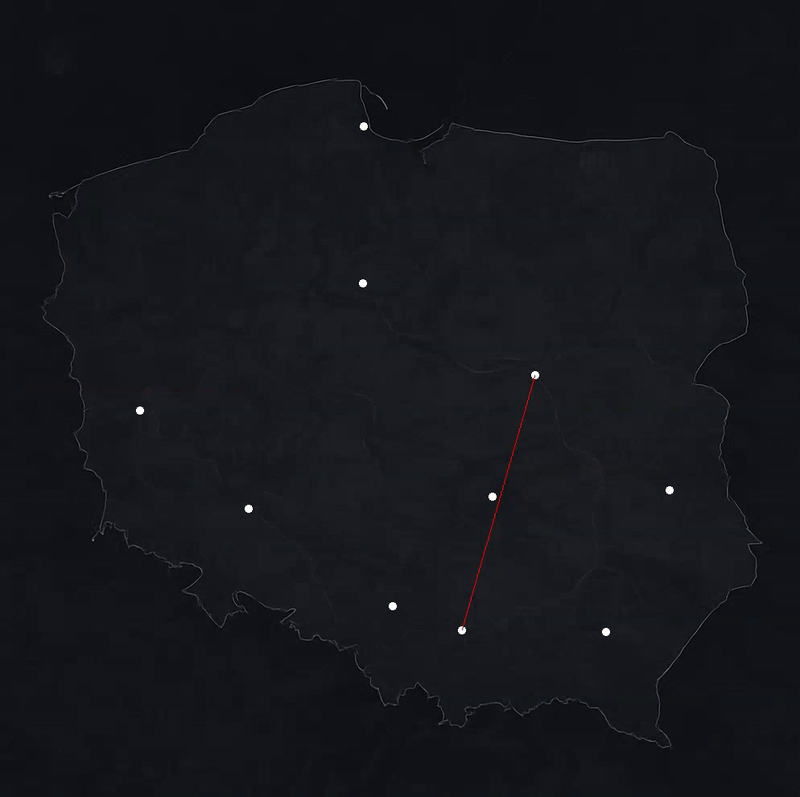

<p align="center">
  
</p>

# TSP-Visualizer

A C++ project for visualizing solutions to the **Travelling Salesman Problem (TSP)** using **SFML**, with support for both coordinate-based points and real-world cities in Poland.

---

## Features
- Interactive visualization of TSP algorithms:
  - [Brute Force](https://en.wikipedia.org/wiki/Brute-force_search) (Θ(n!))
  - [Nearest Neighbor](https://en.wikipedia.org/wiki/Nearest_neighbour_algorithm) (Θ(n²))
  - [Greedy](https://www.youtube.com/watch?v=nYKsLRxIBmA) (Θ(n² log n))
  - [2-opt](https://en.wikipedia.org/wiki/2-opt) (Worst-case O(n² · 2ⁿ), average-case O(n³) (empirical))
- Two input modes:
  - Manual coordinate input
  - Real-world Polish cities (via OpenRouteService API)
- Real map of Poland as background for city mode
- Smooth visualization with colored transitions

---

## Visualization
Brute Force in coordinate input mode:
<p align="left">
  
</p>

Nearest Neighbor in city input mode:
<p align="left">
  
</p>

Greedy in coordinate input mode:
<p align="left">
  
</p>

2-opt in coordinate input mode:
<p align="left">
  
</p>

---

## Getting Started

### Prerequisites
- **SFML 3.0.0**:
  - Place includes in `C:\SFML\include` and libs in `C:\SFML\lib`
  - Add `C:\SFML\bin` to your system `PATH`so the runtime can find required DLLs
- **cURL**:
  - Place includes in `C:\libs\curl\include` and libs in `C:\libs\curl\lib`
- **OpenRouteService API key**: Required for city mode

### API Key Setup
1. Sign up at [openrouteservice.org](https://openrouteservice.org)
2. Copy your API key
3. Duplicate the config template:
   - Copy `src/config.example.json` → `src/config.json`
4. Paste your API key inside:

```json
{
  "ors_api_key": "YOUR_API_KEY_HERE"
}
```


---

## Running the Program

Compile with this line:
```bash
g++ main.cpp Point.cpp Point_Manager.cpp TSP_Brute_Force.cpp VisualizerController.cpp TSP_NN.cpp TSP_Greedy.cpp TSP_2Opt.cpp CityTSPRunner.cpp ConfigLoader.cpp OpenRouteServiceClient.cpp -o tsp_visualizer.exe -IC:\SFML\include -LC:\SFML\lib -lsfml-graphics -lsfml-window -lsfml-system -lopengl32 -lgdi32 -IC:\libs\curl\include -LC:\libs\curl\lib -lcurl -Iexternal
```
Then run:
```bash
./tsp_visualizer.exe
```

Follow the terminal prompts to:
- Choose input mode (coordinates or cities)
- Select algorithm
- Input data (either coordinates or city names)

---

## Project Structure
```
src/
├── assets/                  # Background map
│   └── poland_map.png
├── external/               # Third-party headers
│   └── nlohmann/json.hpp
├── config.json             # (Your API key — NOT COMMITTED)
├── config.example.json     # Public template for config
├── main.cpp
├── TSP_*.cpp               # Algorithms
└── ...                     # Core logic and visualization
```
---

## External Libraries Used

This project relies on the following third-party C++ libraries:

### SFML
- **Purpose**: Graphics, windowing, and input.
- **Used in**: `VisualizerController`
- **Website**: [sfml-dev.org](https://www.sfml-dev.org)

### libcurl
- **Purpose**: HTTP requests to OpenRouteService.
- **Used in**: `OpenRouteServiceClient`
- **Website**: [curl.se](https://curl.se)

### nlohmann/json
- **Purpose**: JSON parsing and serialization.
- **Used in**: `OpenRouteServiceClient`
- **Website**: [github.com/nlohmann/json](https://github.com/nlohmann/json)